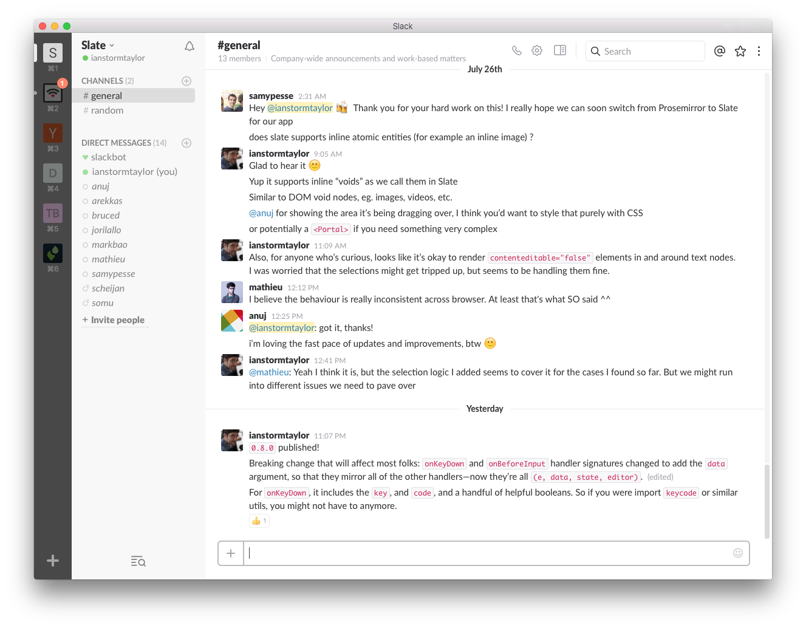

# Contributing

Want to contribute to Slate? That would be awesome!

- [Reporting Bugs](#reporting-bugs)
- [Asking Questions](#asking-questions)
- [Submitting Pull Requests](#submitting-pull-requests)
- [Running Tests](#running-tests)
- [Running Examples](#running-examples)
- [Adding Browser Support](#adding-browser-support)


## Reporting Bugs

If you run into any weird behavior while using Slate, feel free to open a new issue in this repository! Please run a **search before opening** a new issue, to make sure that someone else hasn't already reported or solved the bug you've found.

Any issue you open must include:

- A [JSFiddle](https://jsfiddle.net/2zokvrvt/7/) that reproduces the bug with a minimal setup.
- A GIF showing the issue in action. (Using something like [RecordIt](http://recordit.co/).)
- A clear explanation of what the issue is.

Here's a [JSFiddle template for Slate](https://jsfiddle.net/2zokvrvt/7/) to get you started:

[](https://jsfiddle.net/2zokvrvt/7/)


## Asking Questions

We've also got a [Slate Slack team](https://slate-slack.herokuapp.com) where you can ask questions and get answers from other people using Slate:

[](https://slate-slack.herokuapp.com)

Please use the Slack instead of asking questions in issues, since we want to reserve issues for keeping track of bugs and features. We close questions in issues so that maintaining the project isn't overwhelming.


## Submitting Pull Requests

All pull requests are super welcomed and greatly appreciated! Easy issues are marked with an [`easy-one`](https://github.com/ianstormtaylor/slate/issues?q=is%3Aopen+is%3Aissue+label%3Aeasy-one) label if you're looking for a simple place to get familiar with the code base.

Please include tests and docs with every pull request!


## Running Tests

To run the examples, you need to have the Slate repository cloned to your computer. After that, you need to `cd` into the directory where you cloned it, and install the dependencies from `npm`.

```
npm install
```

Which will also compile the source files. Then run the tests with:

```
npm run tests
```

If you need to debug something, you can add a `debugger` line to the source, and then run `npm run tests debug`. Or, if you only want to run a specific test or tests, you can run `npm run tests -- --fgrep "match this string"` flag which will filter the tests being run.

To keep the source rebuilding on every file change, you need to run an additional watching command:

```
npm run watch
```


## Running Examples

Check out the [Examples readme](./examples) to see how to get the examples running locally!


## Adding Browser Support

Slate aims to targeted all of the modern browsers, and eventually the modern mobile platforms. Right now browser support is limited to the latest versions of [Chrome](https://www.google.com/chrome/browser/desktop/), [Firefox](https://www.mozilla.org/en-US/firefox/new/), and [Safari](http://www.apple.com/safari/), but if you are interested in adding support for another modern platform, that is welcomed!


